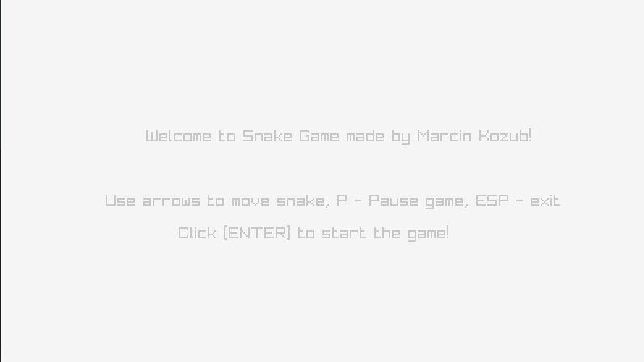
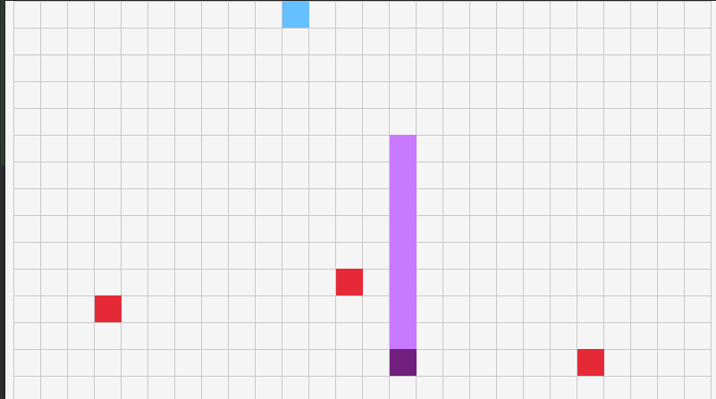
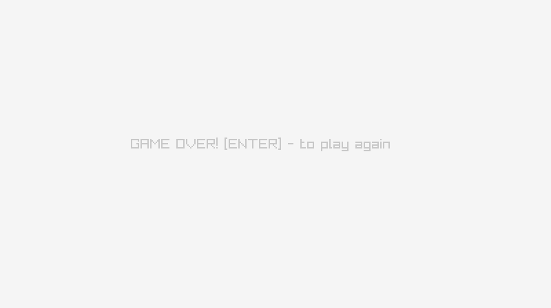

# Snake-Game-Cpp

## How to play

* use arrows to move snake
* eat blue rectangles to extend yourself
* eating red rectangles make you smaller
* click P to pause game
* ESC to exit

## Overview
Welcome screen.

During playing.

Game over.

